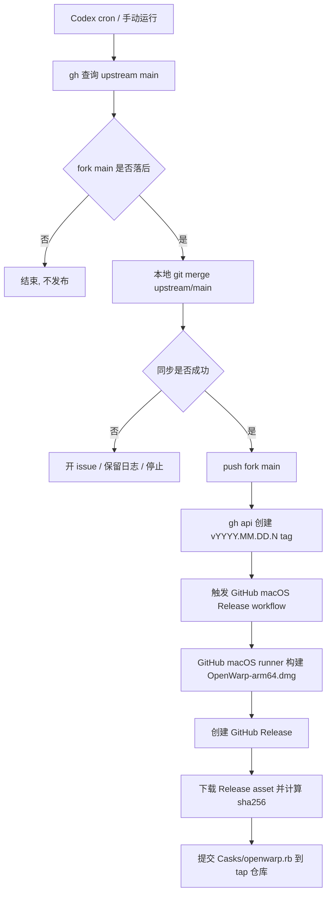

# OpenWarp 自动同步上游与 Homebrew 发布计划书

## 目标

把 `https://github.com/LeoYoung-code/warp` 的 `main` 分支做成一条可重复、可回滚、可审计的自动发布链路:

1. 定时或手动检查上游仓库是否有新提交。
2. 将上游变更合入 `LeoYoung-code/warp:main`。
3. 合入成功后打 tag, 触发 GitHub Actions 在 GitHub macOS runner 上编译 mac arm64 安装包。
4. GitHub Actions 构建成功后创建 GitHub Release, 上传 macOS arm64 DMG。
5. 计算 DMG 的 `sha256`, 同步到 Homebrew tap/cask 仓库。
6. 用户可以通过 `brew install --cask openwarp` 安装新版本。

本计划优先实现 macOS arm64。现有 release workflow 已经同时构建 Windows 和 Linux, 但这条自动发布链路应收敛为 macOS arm64 -> GitHub Release -> Homebrew tap, 避免 Windows/Linux 构建失败阻塞 brew 发布。

## Owner 四问

### 根因

现在发布动作分散在人工步骤里:同步上游、打 tag、跑 release workflow、创建 GitHub Release、更新 Homebrew cask 都需要手动串联。只要其中一步漏做或使用了错误 remote/tag, 最终就会出现 main 已更新但没有安装包、Release 有资产但 Homebrew 仍指向旧版本、或者在错误仓库发布的情况。

### 影响范围

主要影响 CI/CD 配置和发布仓库, 不应改业务代码。涉及范围:

- `LeoYoung-code/warp` 仓库的 `.github/workflows/`。
- 现有 macOS 打包脚本 `script/bundle` 与 `script/macos/bundle` 的调用方式。
- GitHub Release 资产命名和 tag 规则。
- Homebrew tap 仓库, 建议新建 `LeoYoung-code/homebrew-openwarp`。

### 预防措施

发布链路必须具备这些护栏:

- 上游同步前先做 dry-run merge, 有冲突就停止并开 issue, 不自动硬推覆盖。
- 只有 GitHub macOS arm64 构建成功后才创建 GitHub Release。
- 只有 Release 资产真实存在、`sha256` 计算完成后才更新 Homebrew tap。
- Homebrew tap 更新用独立 token, 最小权限只允许写 tap 仓库。
- 同一上游 commit 只发布一次, 用 tag 和 release marker 去重。

### 数据在哪

- 上游新提交:GitHub API 或 `git ls-remote <upstream> main`。
- 当前 fork main:`git ls-remote https://github.com/LeoYoung-code/warp.git main`。
- 构建产物:GitHub Actions macOS runner 生成的 DMG artifact 与 GitHub Release asset。
- 发布版本:Git tag, 建议 `vYYYY.MM.DD.N`。
- Homebrew 安装入口:tap 仓库的 `Casks/openwarp.rb`。
- 审计记录:Actions run log、Release body、tap commit message。

## 当前仓库证据

当前仓库已有一条 `OpenWarp Release` workflow, tag `v*` 或手动 dispatch 会触发。它的结构是 `prepare_metadata` -> `release_macos` / `release_windows` / `release_linux` -> `publish_release`, 并且明确要求所有平台 build 成功后才创建 Release, 避免空 Release。见 `.github/workflows/openwarp_release.yml:22`、`.github/workflows/openwarp_release.yml:78`、`.github/workflows/openwarp_release.yml:228`。

macOS release job 已经调用 `script/bundle --channel "$CHANNEL" --arch aarch64 --dmg-name-suffix arm64`, 并上传 `${{ steps.bundle_app.outputs.dmg_path }}`。这说明自动化不需要重新发明 macOS 打包方式, 应复用现有脚本。见 `.github/workflows/openwarp_release.yml:118`。

`script/macos/bundle` 的 `oss` channel 会生成 `warp-oss`、bundle id `dev.openwarp.OpenWarp`、app 名 `OpenWarp`, 并启用 `release_bundle,extern_plist,autoupdate`。见 `script/macos/bundle:317`。脚本最终把 DMG 路径写入 `GITHUB_OUTPUT` 的 `dmg_path`, 这是 Homebrew 更新 job 可以消费的权威产物路径。见 `script/macos/bundle:853`。

当前本地 remote 曾经存在歧义:`fork` 指向 `https://github.com/LeoYoung-code/warp.git`, `origin` 指向 `git@github.com:zerx-lab/warp.git`。自动发布实现中必须显式写清楚目标仓库和上游仓库, 不能依赖本地 remote 名称。

## 推荐架构

采用 `Codex 定时任务 + GitHub macOS Release workflow` 的分工, 权责分离:

1. Codex cron 自动化:定时运行 `gh`/`git` 命令检查上游、在本地合并上游到 `LeoYoung-code/warp:main`、创建发布 tag。
2. GitHub Actions macOS release workflow:tag 触发后在 GitHub macOS arm64 runner 上编译 `OpenWarp-arm64.dmg`, 创建 GitHub Release, 然后更新 Homebrew tap 仓库。

这样做的好处是同步逻辑不需要新增仓库内 schedule workflow, 可以在 Codex 侧集中管理定时任务和运行日志; 编译包、Release、Homebrew 更新全部发生在 GitHub 上, 产物来源可审计, 构建失败不会更新 Homebrew。失败边界清晰, 容易重跑。



## 阶段 1:准备仓库和权限

### 1.1 确认上游来源

在 GitHub Actions 里不要使用 `origin` / `fork` 这种本地 remote 习惯名, 直接配置完整 URL:

- 发布仓库:`https://github.com/LeoYoung-code/warp.git`
- 上游仓库:需要最终确认, 当前本地证据倾向为 `https://github.com/zerx-lab/warp.git`
- Homebrew tap:`https://github.com/LeoYoung-code/homebrew-openwarp.git`

上线前验收命令:

```bash
gh repo view LeoYoung-code/warp --json nameWithOwner,defaultBranchRef,viewerPermission
gh repo view zerx-lab/warp --json nameWithOwner,defaultBranchRef,viewerPermission
gh repo view LeoYoung-code/homebrew-openwarp --json nameWithOwner,defaultBranchRef,viewerPermission
```

### 1.2 新建 Homebrew tap 仓库

建议仓库名:`LeoYoung-code/homebrew-openwarp`。Homebrew tap 命名规范会让用户使用:

```bash
brew tap LeoYoung-code/openwarp
brew install --cask openwarp
```

仓库初始结构:

```text
Casks/openwarp.rb
README.md
```

### 1.3 配置 GitHub Secrets

在 `LeoYoung-code/warp` 配置:

- `UPSTREAM_REPO`:例如 `zerx-lab/warp`。
- `RELEASE_PAT`:有 `contents:write` 权限, 用于推 main 和 tag。若默认 `GITHUB_TOKEN` 权限足够, 可不加。
- `HOMEBREW_TAP_REPO`:例如 `LeoYoung-code/homebrew-openwarp`。
- `HOMEBREW_TAP_TOKEN`:只对 tap 仓库有写权限的 fine-grained token。

如果后续要发布可被 Gatekeeper 顺滑打开的 macOS app, 还需要 Apple Developer 证书和 notarization secrets。当前现有 release workflow 注释写明“不签名”, 这意味着用户通过 Homebrew 安装后首次打开可能遇到安全提示。这个问题不影响自动化闭环, 但影响用户体验。

## 阶段 2:实现自动同步上游

不在仓库里新增 `.github/workflows/sync_upstream.yml`。自动同步上游改为新建一个 Codex cron 定时任务, 由 Codex 在本地工作区运行 `gh`/`git` 命令完成同步和打 tag。GitHub Actions 只在 tag 推送后负责 GitHub 上的 macOS arm64 编译、GitHub Release 和 Homebrew 更新。

触发策略:

- Codex cron:每天固定一次, 例如北京时间凌晨 03:30。
- 手动补跑:在 Codex 里直接运行同一套 `gh` 命令或触发同一条 automation。
- 并发控制:Codex 任务开始时先检查 GitHub 上是否已有 `OpenWarp Release` workflow 正在运行; 如果有, 本轮直接退出, 避免重复 tag 和重复发布。

核心步骤:

1. `gh auth status` 确认当前账号能读上游、写 `LeoYoung-code/warp`、创建 issue 和 tag。
2. 用 `gh repo view` 固化仓库身份, 避免把本地 `origin` / `fork` 名称当成真实发布目标。
3. 用 `gh api repos/{owner}/{repo}/commits/main --jq .sha` 分别读取上游 `main` 和 fork `main` 的 HEAD SHA。
4. 如果两个 SHA 一致, 或 fork 已经包含上游 HEAD, 直接结束并记录“无需发布”。
5. 在本地工作区确保工作树干净, 添加/刷新 `publish` 与 `upstream` remote, 分别 fetch `main`。
6. 从 `publish/main` 创建临时分支, 执行 `git merge --no-edit upstream/main`。这里不能用 `gh repo sync`, 因为它只做 fast-forward 或 `--force` hard reset, 不能保留 OpenWarp fork 的自有提交并生成 merge commit。
7. 如果 merge 冲突, 用 `git diff --name-only --diff-filter=U` 提取冲突文件, 用 `gh issue create` 开同步失败 issue, 然后 `git merge --abort`, 不 push。
8. merge 成功后做轻量仓库健康检查, 例如 `cargo fmt --check` 或仅校验工作树/merge 结果; 不在 Codex 阶段承担正式 macOS 编译。
9. 检查通过后把临时分支推送到 `LeoYoung-code/warp:main`。
10. 同步成功后, 重新读取 `LeoYoung-code/warp:main` HEAD SHA, 作为本次发布 commit。
11. 检查该 commit 是否已有 `v*` release marker; 如果已经发布过, 直接结束。
12. 生成 tag, 用 `git tag && git push` 或 `gh api repos/LeoYoung-code/warp/git/refs` 创建 tag ref, 触发 GitHub macOS release workflow。
13. 用 `gh run list --workflow openwarp_release.yml --repo LeoYoung-code/warp --limit 5` 记录触发结果; Codex 定时任务的最终输出必须包含同步范围、tag、GitHub workflow run URL。

推荐 Codex cron 配置:

```text
name: OpenWarp upstream sync
kind: cron
workspace: /Users/staff/project/AI/warp
schedule: 每天 03:30 Asia/Shanghai
prompt: 使用 gh 命令检查 zerx-lab/warp main 是否有新提交; 如果 LeoYoung-code/warp main 落后, 在本地从 publish/main 创建临时分支并 git merge upstream/main, 轻量校验通过后推送到 LeoYoung-code/warp main; 同步成功后创建 vYYYY.MM.DD.N tag 触发 GitHub macOS release workflow; 如果同步冲突, 使用 git diff --name-only --diff-filter=U 提取冲突文件, 用 gh issue create 在 LeoYoung-code/warp 创建 issue 并附冲突文件、上游 SHA、fork SHA、Actions/Codex 日志摘要; 结束时汇报是否同步、发布 tag、workflow run URL。
```

Codex 任务里应执行的命令骨架:

```bash
set -euo pipefail

PUBLISH_REPO="LeoYoung-code/warp"
UPSTREAM_REPO="zerx-lab/warp"
BRANCH="main"
PUBLISH_REMOTE="publish"
UPSTREAM_REMOTE="upstream"

gh auth status
gh repo view "$PUBLISH_REPO" --json nameWithOwner,defaultBranchRef,viewerPermission
gh repo view "$UPSTREAM_REPO" --json nameWithOwner,defaultBranchRef,viewerPermission

upstream_sha="$(gh api "repos/$UPSTREAM_REPO/commits/$BRANCH" --jq .sha)"
publish_sha="$(gh api "repos/$PUBLISH_REPO/commits/$BRANCH" --jq .sha)"

if [[ "$upstream_sha" == "$publish_sha" ]]; then
  echo "No upstream changes: $publish_sha"
  exit 0
fi

running_release_count="$(gh run list \
  --repo "$PUBLISH_REPO" \
  --workflow openwarp_release.yml \
  --status in_progress \
  --json databaseId \
  --jq 'length')"

if [[ "$running_release_count" != "0" ]]; then
  echo "OpenWarp Release is already running; skip this round."
  exit 0
fi

if [[ -n "$(git status --porcelain)" ]]; then
  echo "Worktree is dirty; abort to avoid mixing automation with local edits."
  git status --short
  exit 1
fi

git remote remove "$PUBLISH_REMOTE" >/dev/null 2>&1 || true
git remote remove "$UPSTREAM_REMOTE" >/dev/null 2>&1 || true
git remote add "$PUBLISH_REMOTE" "https://github.com/$PUBLISH_REPO.git"
git remote add "$UPSTREAM_REMOTE" "https://github.com/$UPSTREAM_REPO.git"
git fetch "$PUBLISH_REMOTE" "$BRANCH" --tags
git fetch "$UPSTREAM_REMOTE" "$BRANCH"

merge_branch="automation/openwarp-upstream-sync-$(date +%Y%m%d-%H%M%S)"
git checkout -B "$merge_branch" "$PUBLISH_REMOTE/$BRANCH"

if ! git merge --no-edit "$UPSTREAM_REMOTE/$BRANCH"; then
  conflict_files="$(git diff --name-only --diff-filter=U || true)"
  git merge --abort || true
  gh issue create \
    --repo "$PUBLISH_REPO" \
    --title "上游同步失败: $UPSTREAM_REPO@$upstream_sha" \
    --body "本地 git merge 失败。上游: $UPSTREAM_REPO@$upstream_sha; fork: $PUBLISH_REPO@$publish_sha。冲突文件:\n\n$conflict_files"
  exit 1
fi

cargo fmt --check

git push "$PUBLISH_REMOTE" "HEAD:$BRANCH"
new_sha="$(gh api "repos/$PUBLISH_REPO/commits/$BRANCH" --jq .sha)"
version="$(date +%Y.%m.%d).1"
tag="v$version"

if gh release view "$tag" --repo "$PUBLISH_REPO" >/dev/null 2>&1; then
  echo "Release $tag already exists; skip."
  exit 0
fi

git tag "$tag" "$new_sha"
git push "$PUBLISH_REMOTE" "$tag"

gh run list --repo "$PUBLISH_REPO" --workflow openwarp_release.yml --limit 5
```

正式实现时, `version` 的最后一段不能固定为 `.1`; 应根据当天已存在的 `vYYYY.MM.DD.*` tag 自动递增, 避免同一天多次同步时 tag 冲突。

建议 tag 规则:

```text
vYYYY.MM.DD.N
```

现有 `openwarp_release.yml` 只监听 `v*`, 所以有两个选择:

- 保持兼容:tag 用 `v0.YYYY.MM.DD.N`。
- 更清楚:把 release workflow 的 tag 触发改为支持 `v*`。

推荐第二种, 因为 `v0.*` 难以表达这是 OpenWarp 自动同步发布, 也不方便和未来手动 release 区分。

冲突处理策略:

- 自动创建 issue, 标题如 `上游同步失败: upstream/main @ <sha>`。
- issue body 包含冲突文件、上游 commit range、Codex automation run 摘要、必要时附本地 dry-run merge 输出。
- 不自动开 PR, 除非希望人工 review 后合并。OpenWarp fork 如果希望 main 永远可发布, 冲突时 PR 更安全。

## 阶段 3:调整现有 release workflow

在 GitHub 上新增或改造一个只负责 macOS arm64 的 release workflow。建议保留现有 `.github/workflows/openwarp_release.yml` 作为全平台手动发布入口，另建 `.github/workflows/openwarp_macos_release.yml` 作为自动链路入口。

自动链路的 workflow 要点:

1. `on.push.tags` 支持自动链路 tag:

```yaml
on:
  push:
    tags:
      - "v*"
```

2. 只保留 macOS arm64 job, 不依赖 Windows/Linux job:

- `openwarp_macos_release.yml`:自动同步后必跑, 只产 Homebrew 需要的 macOS DMG。
- `openwarp_release.yml`:手动或 tag 触发全平台发布。

3. macOS job 在 GitHub macOS runner 上调用现有脚本, 明确加 `--nosign`, 因为当前计划没有 Apple notarization secrets:

```bash
script/bundle --channel "$CHANNEL" --arch aarch64 --dmg-name-suffix arm64 --nosign
```

当前脚本在未传 `--read-passwords-from-env` 时会自动跳过 code signing, 但显式 `--nosign` 更容易读懂。

4. `publish_release` 完成后输出 macOS asset URL, 供 `update_homebrew` job 使用。可以通过 `gh release view "$TAG" --json assets` 找到 `OpenWarp-arm64.dmg`。

5. `update_homebrew` job 与 `publish_release` 放在同一个 GitHub Actions workflow 内, 这样“GitHub 编译成功 -> GitHub Release 成功 -> GitHub 更新 brew 仓库”是一条原子链路。

## 阶段 4:同步 Homebrew tap

在 GitHub macOS release workflow 最后新增 `update_homebrew` job, `needs: publish_release`。

输入:

- release tag:`needs.prepare_metadata.outputs.release_tag`
- GitHub Release asset URL:`https://github.com/LeoYoung-code/warp/releases/download/<tag>/OpenWarp-arm64.dmg`

步骤:

1. 在 GitHub Actions runner 上从刚创建的 GitHub Release 下载 `OpenWarp-arm64.dmg` 到临时目录。
2. 计算 `sha256sum` 或 macOS `shasum -a 256`。
3. checkout `LeoYoung-code/homebrew-openwarp`。
4. 更新 `Casks/openwarp.rb`。
5. 运行 `brew audit --cask --strict Casks/openwarp.rb` 和 `brew install --cask --no-quarantine ./Casks/openwarp.rb`。
6. commit + push。

初版 `Casks/openwarp.rb` 可以是:

```ruby
cask "openwarp" do
  version "2026.05.05.1"
  sha256 "<sha256>"

  url "https://github.com/LeoYoung-code/warp/releases/download/v#{version}/OpenWarp-arm64.dmg",
      verified: "github.com/LeoYoung-code/warp/"
  name "OpenWarp"
  desc "Open-source build of Warp terminal"
  homepage "https://github.com/LeoYoung-code/warp"

  app "OpenWarp.app"

  zap trash: [
    "~/Library/Application Support/dev.openwarp.OpenWarp",
    "~/Library/Preferences/dev.openwarp.OpenWarp.plist",
  ]
end
```

如果 tag 使用 `vYYYY.MM.DD.N`, Homebrew `version` 建议只保留 `YYYY.MM.DD.N`, URL 拼接 `v#{version}`。如果 tag 保持其他前缀格式, cask URL 也必须同步调整。

提交信息必须使用 Conventional Commits 且中文, 例如:

```text
chore(release): 发布 OpenWarp 2026.05.05.1
```

## 阶段 5:验证与验收

### PR 级验证

修改计划后先手动跑同一套 `gh` 命令验证, 不直接启用 Codex cron:

```bash
gh auth status
gh repo view LeoYoung-code/warp --json nameWithOwner,defaultBranchRef,viewerPermission
gh repo view zerx-lab/warp --json nameWithOwner,defaultBranchRef,viewerPermission
gh api repos/zerx-lab/warp/commits/main --jq .sha
gh api repos/LeoYoung-code/warp/commits/main --jq .sha
```

首次只允许 dry-run:

- `gh` 能读取上游和 fork main SHA。
- 能识别 ahead/behind。
- 能生成将要发布的 tag, 且能发现当天已存在 tag 后递增版本尾号。
- 不执行真实 `git merge` / `git push`, 不 push tag。

### 发布级验证

用一个测试 tag 触发 macOS release:

```bash
git tag v2026.05.05.test
git push https://github.com/LeoYoung-code/warp.git v2026.05.05.test
```

验收标准:

- macOS job 成功生成 `OpenWarp-arm64.dmg`。
- GitHub Release 存在且包含 DMG。
- `shasum -a 256 OpenWarp-arm64.dmg` 与 cask 内 sha256 一致。
- tap 仓库出现一条 Conventional Commits 中文提交。
- 本机能执行:

```bash
brew tap LeoYoung-code/openwarp
brew install --cask openwarp
brew list --cask openwarp
```

如果未签名, 需要额外验证首次打开行为, 并在 README 明确说明风险和处理方式。

## 风险与缓解

### 上游同步冲突

风险:上游改动与 OpenWarp fork 的本地改动冲突, 自动 merge 失败。

缓解:冲突时停止, 开 issue, 不更新 main/tag/release。不要使用 `git reset --hard upstream/main` 覆盖 fork 改动。

### 未签名 DMG 影响 Homebrew 用户体验

风险:Homebrew 能安装, 但 macOS Gatekeeper 阻止打开或提示无法验证开发者。

缓解:短期 README 明示;中期接入 Apple Developer ID 签名和 notarization。`script/macos/bundle` 已经支持 `--read-passwords-from-env`, 后续只需替换团队 ID 和证书变量, 不需要重写打包脚本。

### 全平台 release 阻塞 Homebrew

风险:如果自动链路复用现有全平台 `openwarp_release.yml`, Windows/Linux 构建失败会导致 `publish_release` 跳过, macOS DMG 即使成功也无法进入 Homebrew。

缓解:自动同步后的发布链路使用独立 `openwarp_macos_release.yml`, 只跑 macOS arm64;全平台发布保留为手动 workflow。

### tag 重复或同一上游 commit 重复发布

风险:定时任务多次触发同一 commit, 创建重复 Release。

缓解:release body 写入 upstream SHA;同步前用 `gh release list` 或 git tag annotation 查询是否已经发布过该 upstream SHA。

### tap 更新失败造成 Release 与 brew 不一致

风险:GitHub Release 已发布, Homebrew 仍停留旧版本。

缓解:release job summary 必须标红 Homebrew 失败;允许手动 rerun `update_homebrew` job。不要删除已发布 Release, 除非 DMG 本身损坏。

## 实施顺序

1. 新建 `LeoYoung-code/homebrew-openwarp` tap 仓库, 手工提交初版 `Casks/openwarp.rb`。
2. 新增或改造 GitHub macOS-only release workflow, 用测试 tag 验证 GitHub 上能编译出 `OpenWarp-arm64.dmg` 并创建 Release。
3. 在同一个 GitHub workflow 里增加 `update_homebrew` job, 用测试 Release 验证 cask 更新和本机安装。
4. 在 Codex 中新建 OpenWarp upstream sync 定时任务, 先只保存为暂停状态或只手动运行 dry-run。
5. 手动跑 `gh` dry-run, 验证 upstream/fork main 比较逻辑。
6. 允许 Codex 任务在无冲突时执行本地 `git merge`, 但先不 push `main` 或 tag。
7. 打开 Codex 任务的正式 main push 和 tag push, 让 GitHub workflow 完成 macOS 编译、Release 和 brew 同步。
8. 启用 Codex cron, 默认每天一次;稳定后再考虑每小时检查。

## 最小可交付版本

第一版只做这些:

- Codex 定时任务使用 `gh` 手动或定时同步上游。
- 自动 merge 成功后 push `main`。
- 自动创建 `vYYYY.MM.DD.N` tag。
- GitHub Actions 只构建 macOS arm64 unsigned DMG。
- GitHub Actions 创建 GitHub Release。
- GitHub Actions 更新 Homebrew cask。

暂不做:

- Windows/Linux 自动发布强绑定。
- Apple 签名和 notarization。
- 自动 changelog 分类。
- 自动回滚已发布 cask。

这样能先把核心闭环跑通, 后续再把签名、公证和全平台发布接进去。

## 交付后复盘模板

每次发布任务完成后, 在 Actions summary 或 Release issue 里写四段:

1. 回顾目标:本次同步的上游 commit range 和预期发布版本。
2. 评估结果:main/tag/Release/Homebrew tap 是否全部完成, 附对应链接。
3. 分析原因:若失败, 归类为同步冲突、构建失败、Release 失败、tap 更新失败或权限失败。
4. 沉淀规律:把新增的冲突文件、缺失 secret、超时平台或审计失败规则补进后续 SOP。
